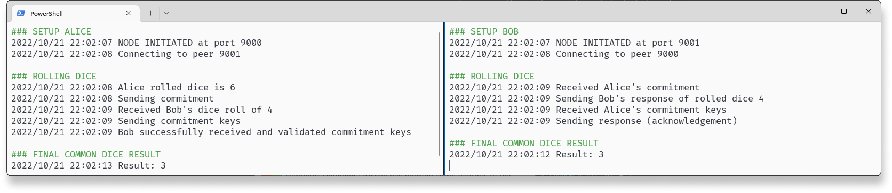

# Mandatory Hand-in 2: Virtual dice

**The second mandatory hand-in in Security 1.**

## Purpose

In a peer-to-peer network, the assignment is to implement a coin-flipping protocol that allows Alice and Bob to roll a virtual dice over an insecure network (assumption: they do not trust each other). The commitment scheme is hash-based, and this ensures that the chosen statement is hidden from every node in the network, but at a later point, this statement can be revealed.

## How to run

Open two terminals that represent Alice and Bob respectively. The format of the command-line input is

```cmd
go run . <flag init> :<port> <port of other nodes> <name>
```

Here, the flag should only be set on one of the nodes, preferably Alice. This flag expects a Boolean value afterwards which here should be true. 
If none are given, then the default value is false.

**Expected command-line input**

-	Alice’s terminal: `go run . -init true :9000 9001 Alice`
-	Bob’s terminal: `go run . :9001 9000 Bob`

This exact input is given in the script [run_split.ps1](./src/run_split.ps1) which creates the two PowerShell terminal instances next to each other.


