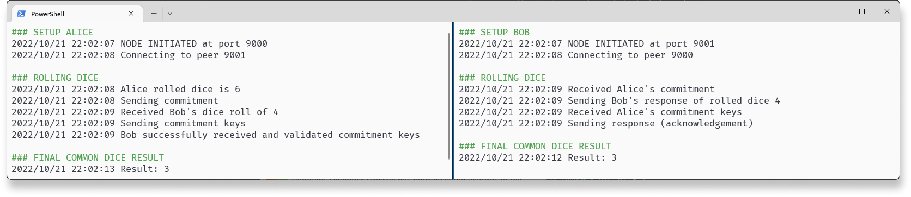

# Mandatory Hand-in 2: Virtual dice

**The second mandatory hand-in in Security 1.**

## Purpose

In a peer-to-peer network, the assignment is to implement a coin-flipping protocol that allows Alice and Bob to roll a virtual dice over an insecure network (assumption: they do not trust each other). The commitment scheme is hash-based, and this ensures that the chosen statement is hidden from every node in the network, but at a later point, this statement can be revealed.

## How to run

Open two terminals that represent Alice and Bob respectively. The format of the command-line input is

```cmd
go run . <flag init> :<port> <port of other nodes> <name>
```

Here, the flag should only be set on one of the nodes, preferably Alice. This flag expects a boolean value afterwards which here should be `true`.  If none are given, then the default value is `false`.

**Expected command-line input**

```cmd
Alice’s terminal: go run . -init true :9000 9001 Alice
Bob’s terminal:   go run . :9001 9000 Bob
```

This exact input is given in the script [run_split.ps1](./src/run_split.ps1) which creates the two PowerShell terminal instances next to each other (shown below).



## Errors

Since we are dealing with GRPC, Googles RPC framework, that connects services, sometimes errors occur.

### RPC error

**Error on server :: rpc error: code = Unavailable desc = connection error: desc = "transport: Error while dialing dial tcp [::1]:9001:**

This happens when the Bob server takes too much time loading up. Close terminal, and try again.

### Usage of more than one socket address

**Server failed to listen af port :9001 :: listen tcp :9001: bind: Only one usage of each socket address (protocol/network address/port) is normally permitted.**

If a previous terminal instance is not closed, then the error message of multiple socker address usage is shown. Close both terminals, and try again.
